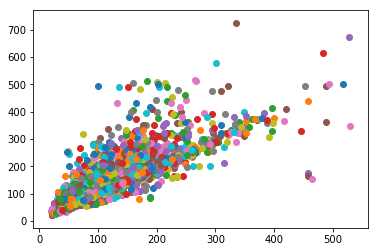
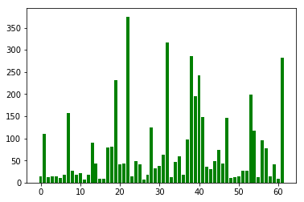

# Traffic-Sign-Classifier-using-Keras


```python
import pandas as pd
import numpy as np
from keras.models import Sequential
from keras.layers import Convolution2D
from keras.layers import MaxPooling2D
from keras.layers import Flatten
from keras.layers import Dense
#from PIL import Image
#import os
#import matplotlib
#import matplotlib.pyplot as plt
#%matplotlib inline
```

## Step 1 : Data-Preprocessing


```python
def convertPpmJpg(data_dir) :
    '''Converts the .ppm format into .jpg format to make it readable for keras'''
    
    #Get to the required folder
    directories = [os.path.join(data_dir, d) for d in os.listdir(data_dir)] 
    label_dir = []
    file_names = []
    for d in directories:
        label_dir = os.path.join(data_dir, d)
        file_names = [os.path.join(label_dir, f) for f in os.listdir(label_dir) if f.endswith(".ppm")]
        
        #Convert ppm to jpg and delete ppm files
        for img in file_names :
            im = Image.open(img)
            im.save(img.replace('.ppm','.jpg'))
            os.remove(img)
            
        #Delete the csv files present in every directory    
        for files in os.listdir(d) :
            if files.endswith('.csv') :
                os.remove(os.path.join(d,files))
```


```python
#Call the function to convert ppm format to jpg format     
#convertPpmJpg('C:\\Users\\amuly\\Desktop\\Traffic Sign Detection\\datasets\\Training')                
#convertPpmJpg('C:\\Users\\amuly\\Desktop\\Traffic Sign Detection\\datasets\\Testing')
```

## Step 2: Exploratory Data Analysis


```python
image_size = []
root = 'C:\\Users\\amuly\\Desktop\\Traffic Sign Detection\\datasets\\Training'
for d in os.listdir(root) :
    folder = os.path.join(root,d)
    for img in os.listdir(folder) :
        im = Image.open(os.path.join(folder,img))
        image_size.append(im.size)
```


```python
#Lets check out the image sizes
for sizes in image_size :
    x,y = sizes
    plt.scatter(x,y)
```





```python
#Min size
min(image_size)
```


    (20, 37)


```python
#Max size
max(image_size)
```


    (529, 347)


```python
#average size
tuple(map(np.mean, zip(*image_size)))
```


    (109.82601092896175, 124.97245901639344)


```python
#No of samples in every label in the training set
sample_size = {}
for d in os.listdir(root) :
    sample_size[int(d)] = len(os.listdir(os.path.join(root,d)))

plt.bar(list(sample_size.keys()), list(sample_size.values()), color='g')
```


    <Container object of 62 artists>





```python
#Total number of samples in training set
sum(sample_size.values())
```


    4575


```python
#No of samples in every label in the testing set
root = 'C:\\Users\\amuly\\Desktop\\Traffic Sign Detection\\datasets\\Testing'
test_size = {}
for d in os.listdir(root) :
    test_size[int(d)] = len(os.listdir(os.path.join(root,d)))
```


```python
#No of test samples
sum(list(test_size.values()))
```


    2520


## Step 3 : CNN


```python
#Initializing the CNN
classifier = Sequential()

#Convolution
#Arguments : It has 32 feature maps with 3 rows and 3 columns, expected format
#input shape = the size of the image and then  3(R,B,G)
classifier.add(Convolution2D(32, 3, 3, input_shape=(64,64,3),activation = 'relu'))

#Create the pool size of 2x2, thus dividing the vector size by 2 
classifier.add(MaxPooling2D(pool_size=(2,2)))

classifier.add(Flatten())

#hidden layer
# Rule of thumb : No of hidden nodes = (op nodes + input nodes)/2, By experimenting = 128
classifier.add(Dense(output_dim = 128, activation='relu'))

#Output layer
classifier.add(Dense(output_dim = 62, activation='sigmoid'))

#Choose parameters
classifier.compile(optimizer='adam',loss='categorical_crossentropy',metrics=['accuracy'])
```

    /home/bhutada_manasi/anaconda3/lib/python3.5/site-packages/ipykernel/__main__.py:7: UserWarning: Update your `Conv2D` call to the Keras 2 API: `Conv2D(32, (3, 3), activation="relu", input_shape=(64, 64, 3...)`
    /home/bhutada_manasi/anaconda3/lib/python3.5/site-packages/ipykernel/__main__.py:16: UserWarning: Update your `Dense` call to the Keras 2 API: `Dense(activation="relu", units=128)`
    /home/bhutada_manasi/anaconda3/lib/python3.5/site-packages/ipykernel/__main__.py:19: UserWarning: Update your `Dense` call to the Keras 2 API: `Dense(activation="sigmoid", units=62)`


```python
from keras.preprocessing.image import ImageDataGenerator

#Using Data Augmentations like rescale,shear,zoom n flip
#Rescale will scale our pizel between 0 and 255 (Similar to standardization)
#Shear_range = To apply random transformations
#Zoom and flips = zooms n flips the images
#Training and test initialization
train_datagen = ImageDataGenerator(
        rescale=1./255,
        shear_range=0.2,
        zoom_range=0.2,
        horizontal_flip=True)

test_datagen = ImageDataGenerator(rescale=1./255)


#Target size is same as 64x64 we used before
#Batchsize = no of random sample size in CNN at a time
#Class = binary or more than 2 classes
train_set = train_datagen.flow_from_directory(
        'datasets/Training',
        target_size=(64, 64),
        batch_size=32,
        class_mode='categorical')

test_set = test_datagen.flow_from_directory(
        'datasets/Testing',
        target_size=(64, 64),
        batch_size=32,
        class_mode='categorical')


#Steps per epochs = No of observation in oujr training set
#We have used 1000 to save time
#No of epochs = 25 but i used 1 to save time
#validation_steps = No of observation in oujr test set
classifier.fit_generator(
        train_set,
        steps_per_epoch=4575,
        epochs=10,
        validation_data=test_set,
        validation_steps=2520)
```

    Found 4575 images belonging to 62 classes.
    Found 2520 images belonging to 62 classes.
    Epoch 1/10
    4575/4575 [==============================] - 435s - loss: 0.3886 - acc: 0.7857 - val_loss: 0.3070 - val_acc: 0.9444
    Epoch 2/10
    4575/4575 [==============================] - 433s - loss: 0.0382 - acc: 0.9867 - val_loss: 0.3790 - val_acc: 0.9345
    Epoch 3/10
    4575/4575 [==============================] - 445s - loss: 0.0266 - acc: 0.9899 - val_loss: 0.2684 - val_acc: 0.9576
    Epoch 4/10
    4575/4575 [==============================] - 441s - loss: 0.0215 - acc: 0.9928 - val_loss: 0.3016 - val_acc: 0.9535
    Epoch 5/10
    4575/4575 [==============================] - 443s - loss: 0.0172 - acc: 0.9947 - val_loss: 0.3858 - val_acc: 0.9476
    Epoch 6/10
    4575/4575 [==============================] - 437s - loss: 0.0163 - acc: 0.9952 - val_loss: 0.4603 - val_acc: 0.9421
    Epoch 7/10
    4575/4575 [==============================] - 436s - loss: 0.0140 - acc: 0.9957 - val_loss: 0.4021 - val_acc: 0.9522
    Epoch 8/10
    4575/4575 [==============================] - 439s - loss: 0.0137 - acc: 0.9958 - val_loss: 0.4504 - val_acc: 0.9460
    Epoch 9/10
    4575/4575 [==============================] - 441s - loss: 0.0131 - acc: 0.9962 - val_loss: 0.4999 - val_acc: 0.9504
    Epoch 10/10
    4575/4575 [==============================] - 439s - loss: 0.0118 - acc: 0.9964 - val_loss: 0.4501 - val_acc: 0.9500


    <keras.callbacks.History at 0x7eff067f2748>


```python

```


